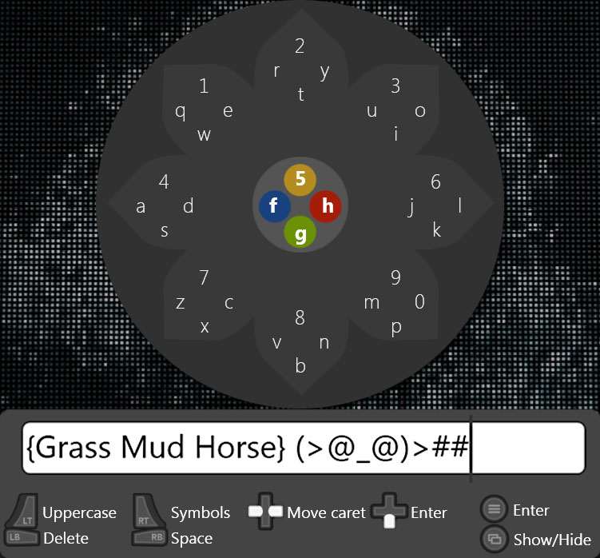

# ControllerOSK

A keyboard input solution for joystick users.

# Installation and Usage

No installation needed. The application will start in tray and you press Back on the GamePad open it.
You can put a shortcut into the Startup folder so it's always available.
